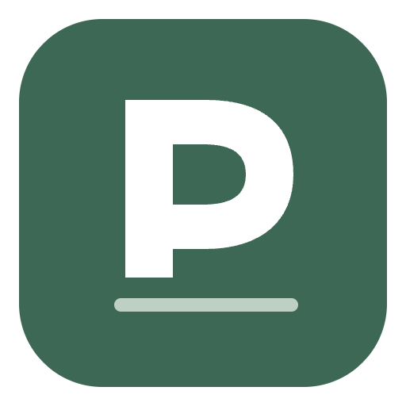
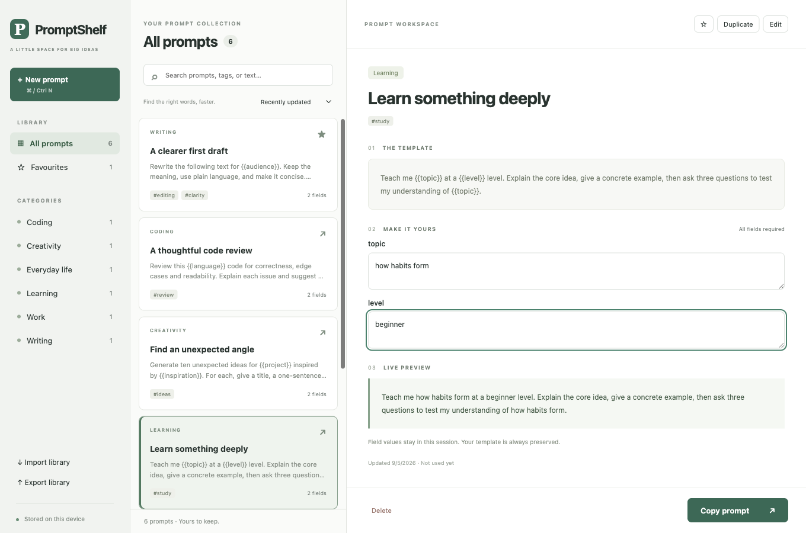

<div align="center">
  
  <h1>PromptShelf</h1>
  <p>A small, offline home for the prompts you use again and again.</p>
  <p><strong>Save → Find → Fill → Copy</strong></p>
  <p>
    <a href="https://github.com/ravikadam/promptshelf/releases/latest">Download the app</a> ·
    <a href="#quick-start">Quick start</a> ·
    <a href="https://github.com/ravikadam/promptshelf/issues">Report a problem</a>
  </p>
</div>


PromptShelf saves reusable AI prompts on your computer. Organise them by category and tags, fill in template fields, and copy the result into whatever AI tool you prefer.

**No login. No backend. No cloud sync. No AI API keys.** The app itself does not call an AI model.



## Download and install

**[Get the latest release →](https://github.com/ravikadam/promptshelf/releases/latest)**

Choose an installer from the release's **Assets** section. You do not need Node.js or any developer tools to use it.

| Your computer                         | File to download                   |
| ------------------------------------- | ---------------------------------- |
| macOS — Apple Silicon (M-series chip) | `PromptShelf-…-mac-arm64.dmg`      |
| macOS — Intel                         | `PromptShelf-…-mac-x64.dmg`        |
| Windows — Intel/AMD, 64-bit           | `PromptShelf-…-win-x64.exe`        |
| Linux — Intel/AMD, 64-bit             | `PromptShelf-…-linux-x64.AppImage` |

- **Mac:** Open the DMG, then drag PromptShelf into Applications. Check **Apple menu → About This Mac** if you are unsure which chip you have.
- **Windows:** Run the `.exe` installer and follow the prompts.
- **Linux:** Give the AppImage execute permission (`chmod +x <downloaded-file>.AppImage`), then open it. FUSE support may be required by your distribution.

These are community builds: macOS uses ad-hoc signing and is not notarized; Windows installers are unsigned. OS trust warnings are expected. For a blocked Mac download, see [Apple's guidance](https://support.apple.com/en-gb/102445) and only allow it if you trust this source. Do not disable system security globally.

Each release includes `SHA256SUMS.txt` so you can check downloaded files. Updates are manual: download the next release and replace the application. Your library lives separately in application data; export a backup before updating.

**Test coverage:** locally tested on macOS Apple Silicon, including the packaged app. CI builds all four targets and runs desktop acceptance tests on macOS. Windows/Linux installation and day-to-day use are not yet manually verified. See [verification details](VERIFICATION.md) and the [build runs](https://github.com/ravikadam/promptshelf/actions).

## Quick start

1. Open a starter prompt from the middle pane.
2. Fill in the required fields on the right. The preview updates as you type.
3. Select **Copy prompt**, then paste it into your preferred AI tool.
4. Use **New prompt** to save your own templates.

For example, save this template:

```text
Explain {{topic}} for {{audience}}.
Give one practical example of {{topic}} and three questions to check my understanding.
```

You will get two inputs: `topic` and `audience`. Both occurrences of `{{topic}}` use the same value. Copying stays disabled until every field is filled. Prompts without fields copy directly.

The original template stays unchanged. **Field values are never persisted.** Names are case-sensitive; spaces around a placeholder name are ignored.

## Features

- Create, edit, duplicate and delete prompts, with confirmation before deleting or discarding unsaved edits.
- Categories, tags and favourites, with search across titles, bodies and tags.
- Sort by recently updated or recently used; copying updates last-use time.
- Live template preview and one input per unique `{{placeholder}}`.
- Export the full library as versioned JSON; validate imports and merge by ID, asking before overwriting matches.
- Six editable starter prompts for writing, learning, work, coding, everyday life and creativity.
- Three-pane layout with empty states, copy confirmation and readable error messages.

| Action       | Windows / Linux | macOS |
| ------------ | --------------- | ----- |
| New prompt   | Ctrl+N          | Cmd+N |
| Focus search | Ctrl+F          | Cmd+F |

## Local data and backups

PromptShelf uses a plain JSON file in Electron's OS application-data directory. The exact directory name can depend on how the application was packaged. Typical paths end in `promptshelf/library.json` or `PromptShelf/library.json` under:

| OS      | Application-data directory          |
| ------- | ----------------------------------- |
| macOS   | `~/Library/Application Support/`    |
| Windows | `%APPDATA%/`                        |
| Linux   | `$XDG_CONFIG_HOME/` or `~/.config/` |

The authoritative path is `app.getPath('userData')` plus `library.json`. A recovery error displays the full path if the file cannot be parsed.

Writes use a temporary file in the same directory, flush it, then atomically rename it. Operations are serialised, and a single-instance lock prevents two app instances competing for the file. Starter prompts appear only when the storage file does not exist; an intentionally empty library stays empty.

**Backups:** use **Export library**. Exports contain saved templates and metadata, including last-used time, but never field values. Files are plain text, not encrypted; handle them like any other personal document.

**Recovery:** corrupt or unsupported storage is preserved. Back up the original file, repair it or move it aside, then restart. Moving it aside creates a fresh starter library. The app does not silently reset your data.

Imports must contain `{ "version": 1, "prompts": [...] }`. Every record is validated before anything changes. Duplicate IDs within an import, malformed fields, invalid timestamps and unsupported versions are rejected. Existing IDs require overwrite confirmation; cancelling leaves the entire library unchanged. Limits: 20 MB in export format, 10,000 prompts, and 100,000 characters per template.

## Development

Built with **Electron, React, TypeScript and Vite**. Requires **Node.js 22+** and npm.

```sh
git clone https://github.com/ravikadam/promptshelf.git
cd promptshelf
npm ci
npm run dev
```

| Command                | Purpose                                            |
| ---------------------- | -------------------------------------------------- |
| `npm run dev`          | Start Vite and Electron locally                    |
| `npm run build`        | Type-check and build the renderer and main process |
| `npm start`            | Launch the production build                        |
| `npm test`             | Run model/storage tests                            |
| `npm run test:e2e`     | Build and run real Electron acceptance tests       |
| `npm run format:check` | Check source formatting                            |
| `npm run package`      | Build an installer for the host OS                 |
| `npm run package:dir`  | Build an unpacked application                      |

The desktop tests use isolated temporary libraries and write to the real system clipboard. File-picker and confirmation responses are stubbed so the tests can run unattended. They require a graphical desktop. See [VERIFICATION.md](VERIFICATION.md) for coverage and limitations.

```text
electron/       Main process, storage, and narrow preload bridge
src/            React interface, styles, and shared model validation
tests/          Core and Electron integration tests
build/          Application icon
docs/           Screenshot, release notes, and sharing copy
.github/        Build and release workflow
```

### Security boundaries

The renderer uses context isolation and sandboxing, with Node integration disabled. Filesystem and clipboard operations run in the main process through a small preload API. IPC callers and imported records are validated. Prompt content is rendered as text, and production loads no remote scripts, fonts or content.

## Packaging and releases

Build on the target operating system:

```sh
npm run package -- --mac --arm64
npm run package -- --mac --x64
npm run package -- --win --x64
npm run package -- --linux --x64
```

Installers are written to `release/`. The macOS `identity: "-"` setting creates an ad-hoc signed app. To distribute without the usual trust warnings, supply your own Apple Developer signing/notarization setup or Windows signing certificate. Credentials do not belong in the repository.

The GitHub Actions workflow builds and tests on pushes and pull requests. A maintainer pushing a version tag (`v1.0.0`, for example) builds all four installers and, only after every build passes, publishes a GitHub Release with downloads and SHA-256 checksums. For future releases, update the package version, lockfile and release notes before tagging.

## Feedback and contributing

This is a small personal project. To report a problem, [open an issue](https://github.com/ravikadam/promptshelf/issues) with your operating system, app version, what you expected and steps to reproduce. Please leave private prompt content out of screenshots and reports.

Small, focused pull requests are welcome. Run the relevant tests and formatting check, and describe any platform you could not test.

## About

I built PromptShelf while trying **Astra as a coding model**. It was a practical experiment in taking a small desktop app from an idea to something friends could use.

## License

[MIT](LICENSE) — you may use, modify and share the app under the license terms.
